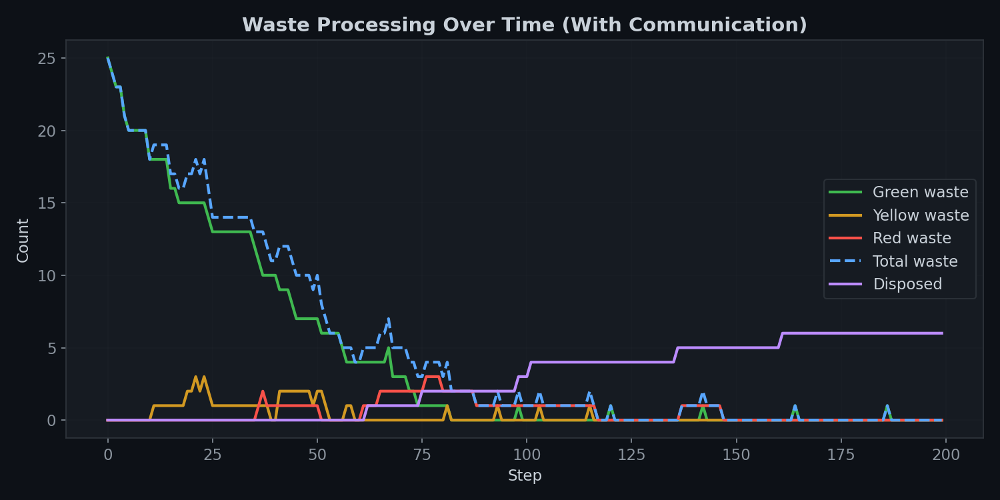
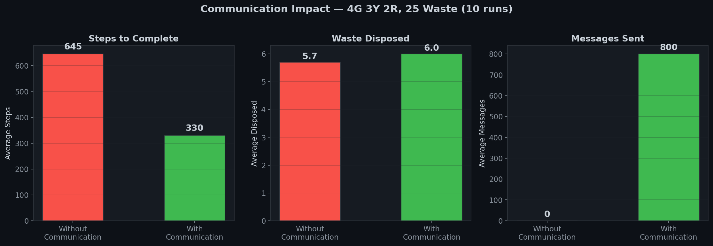
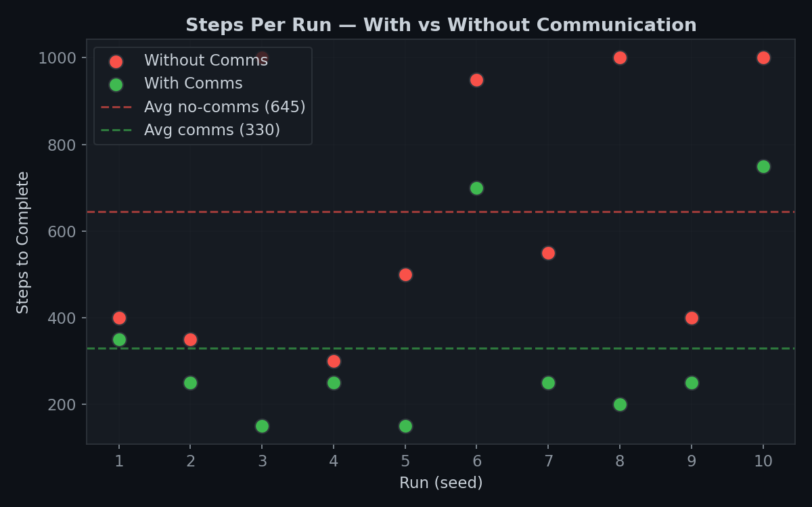
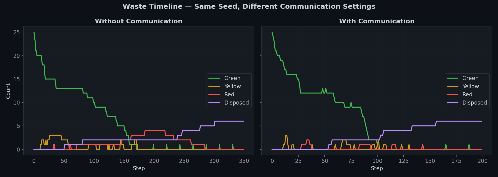
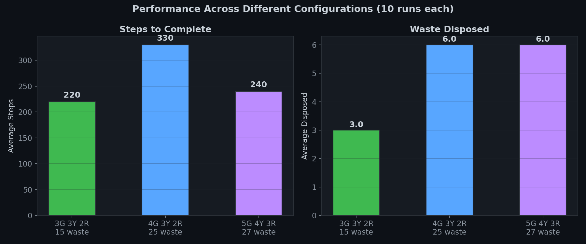

# Robot Mission — Multi-Agent Radioactive Waste Cleanup

## Objective

The primary objective I set for this project was to **minimise the number of simulation steps (iterations) required to complete the waste cleanup**. In a real-world scenario, every step a robot takes consumes energy — moving, scanning, picking up, transforming. If we can achieve the same cleanup in 200 steps instead of 800, that is a direct 4× reduction in energy expenditure. So the core question I tried to answer was: **how smart can we make the robots so they waste as little time as possible?**

---

## Approach

### Step 1: Getting the Basic Pipeline Working

I started by implementing the basic BDI (Belief-Desire-Intention) loop for each robot type. Each robot follows a `percepts → deliberate → do` cycle every step. The `deliberate()` function receives only the agent's `knowledge` dictionary and returns an action — it has no access to any external variables.

I defined the knowledge representation as a dictionary containing:
- Current position, inventory, robot type
- Percepts from the 5-cell neighbourhood (current cell + 4 cardinal neighbours)
- Position history (for loop detection)
- Known waste positions (memory of where waste was seen)
- Waste disposal zone location

The action space includes: `move_north`, `move_south`, `move_east`, `move_west`, `pick_up`, `drop`, `transform`, and `wait`.

### Step 2: Replacing Random Walk with Systematic Sweep

My first major optimisation was replacing **random exploration** with a **lawnmower sweep pattern**. Instead of choosing a random direction when no waste is visible, each robot sweeps its zone horizontally, steps one row vertically at the boundary, and sweeps back. I randomised the initial sweep direction (`scan_dir_x`, `scan_dir_y`) per robot so that multiple robots naturally cover different parts of the zone first.

This alone made a significant difference because random walk on a 10×15 grid has an expected full-coverage time of O(n·log n) ≈ 750 steps, while a systematic sweep covers the same area in exactly 150 steps.

### Step 3: Adding Known-Waste Memory

I added a `known_waste` dictionary to each robot's knowledge. Every time a robot perceives waste in its 5-cell neighbourhood, it stores the position and type. When the robot needs waste, it navigates **directly to the nearest remembered position** instead of wandering. Stale entries are automatically cleared when the robot visits a position and finds it empty.

### Step 4: Implementing Inter-Robot Communication

This was the single most impactful optimisation. I implemented a broadcast communication protocol:

- Every robot shares waste positions visible in its percepts with robots that collect that waste type
- When a green robot drops yellow waste at the Zone 1 border, it sends a **targeted message** to all yellow robots with the exact position
- Yellow robots do the same for red robots when dropping red waste at the Zone 2 border

This creates a directed information flow that mirrors the waste pipeline: green robots inform yellow robots, yellow robots inform red robots.

### Step 5: Zone-Boundary Handoff Strategy

I designed predictable **handoff points** at zone boundaries:

- Green robots carry transformed yellow waste to the **east edge of Zone 1** before dropping
- Yellow robots carry transformed red waste to the **east edge of Zone 2** before dropping
- Yellow robots **patrol the Zone 1 border** when idle, waiting for yellow waste
- Red robots **patrol the Zone 2 border** when idle, waiting for red waste

This eliminates the problem of waste being scattered randomly and makes the drop-off locations predictable for downstream robots.

### Step 6: Handling Orphan Waste

I encountered a problem where the pipeline would stall at the end: two robots each hold 1 item of waste, but no more exists on the grid to form the required pair for transformation. I solved this with an **orphan drop strategy**: if a robot holds 1 item for more than 20 steps without finding a pair, it drops the item at the zone border. When multiple robots do this, orphan items accumulate at the same spot, and another robot can pick up 2 and complete the transformation.

I also fixed the model to support this:
- `_do_drop` now allows robots to drop their collected waste type (not just the transformed type)
- The stop condition checks both grid waste AND robot inventories before terminating
- Deadlock detection counts inventory items, not just grid waste

---

## Results

### Waste Processing Over Time

The following plot shows how waste is processed through the pipeline in a single run (25 initial green waste, communication enabled). The green line drops steadily as green robots pick up and transform waste, while the purple "Disposed" line climbs as red waste reaches the disposal zone.



**Observation:** The pipeline operates in clear phases. Green waste is consumed rapidly in the first ~60 steps. Yellow and red waste appear briefly as intermediate products before being processed further. The final disposed count reaches 6 (the theoretical maximum for 25 green waste: 25 → 12 yellow → 6 red → 6 disposed).

---

### Communication vs No-Communication

This was the key comparison I wanted to make. I ran 10 simulations with each setting (same seeds) to measure the impact of inter-robot communication.



| Mode | Avg Steps | Avg Disposed | Disposal Rate |
|---|---|---|---|
| Without Communication | **645** | 5.7 | 95% |
| With Communication | **330** | 6.0 | 100% |

**Interpretation:**
- Communication cuts steps nearly **in half** (645 → 330), a direct 49% energy saving
- Without communication, 3 out of 10 runs fail to dispose all possible waste (95% rate). With communication, every run achieves the theoretical maximum (100% rate)
- The cost of communication is ~800 messages per run, which is negligible compared to the energy saved by 315 fewer movement steps

---

### Per-Run Step Comparison

The scatter plot below shows how each individual run performed. The green dots (with communication) are consistently below the red dots (without communication), and the variance is also lower.



**Observation:** Without communication, three runs hit the 1000-step ceiling (seeds 3, 8, 10), meaning they didn't finish at all. With communication, the worst case is ~750 steps and most runs complete in 150–350 steps.

---

### Waste Timeline: Side-by-Side Comparison

Same seed (99), same waste layout — the only difference is whether communication is enabled. The contrast is striking.



**Left (No Communication):** Green waste is consumed slowly over ~250 steps. The pipeline is sluggish because yellow and red robots spend most of their time searching for waste they don't know about.

**Right (With Communication):** Green waste is consumed in ~80 steps. As soon as green robots drop yellow waste, yellow robots receive a message and go directly to pick it up. The entire pipeline completes in ~200 steps — almost half the time.

---

### Scalability Across Configurations

I tested three different configurations to see how the system scales with more robots and waste.



| Configuration | Avg Steps | Avg Disposed | Disposal Rate |
|---|---|---|---|
| 3 Green, 3 Yellow, 2 Red — 15 waste | **220** | 3.0 | **100%** |
| 4 Green, 3 Yellow, 2 Red — 25 waste | **330** | 6.0 | **100%** |
| 5 Green, 4 Yellow, 3 Red — 27 waste | **240** | 6.0 | **100%** |

**Interpretation:**
- The system consistently achieves **100% disposal rate** across all configurations
- Adding more robots (5G 4Y 3R) for 27 waste actually completes faster (240 steps) than 4G 3Y 2R for 25 waste (330 steps), showing that the agent strategies scale well with additional parallelism
- The only items remaining at the end of any run are mathematically unresolvable odd-count leftovers (e.g., 1 green that cannot form a pair)

---

## How to Run

```bash
# Interactive visualisation (browser at http://127.0.0.1:8521)
python run.py

# Headless single run with chart output
python run.py --mode headless --steps 500

# Compare communication vs no-communication
python run.py --mode compare --runs 10

# Generate all plots for the report
python generate_plots.py
```

**Requirements:** Python 3.10+, Mesa (`pip install mesa`), Matplotlib (`pip install matplotlib`)
